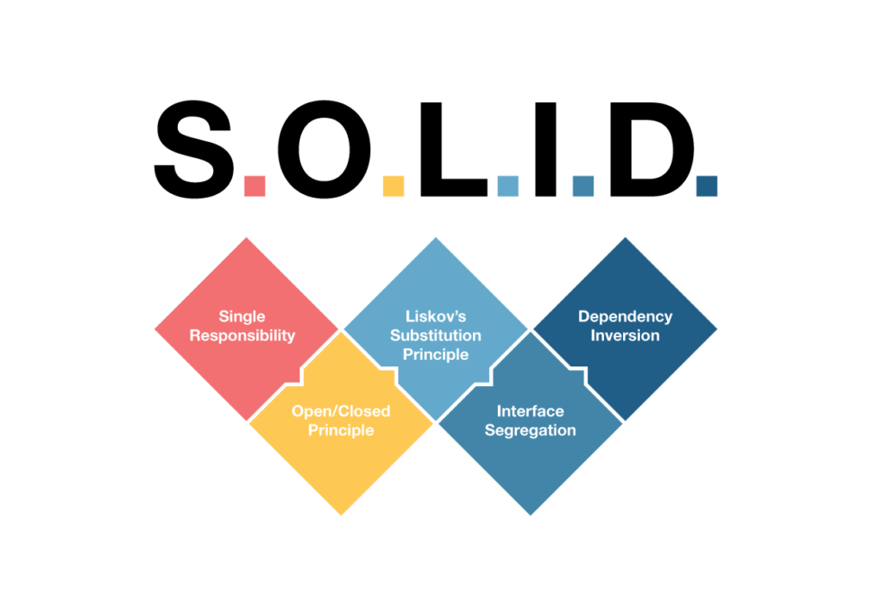

<p align="center">
  <a href="#" target="blank"></a>
</p>

## Los 5 principios para desarrollar software de calidad

### 4. Principio de segregación de interfaz (Interface Segregation Principle): ISP

Es un principio fundamental en la programación orientada a objetos. Este principio establece que los clientes de un programa dado solo deberían conocer de este aquellos métodos que realmente usan, y no aquellos que no necesitan usar.

En otras palabras, las interfaces deben ser lo más pequeñas posible, por lo que hay que evitar incluir métodos que no son necesarios para todos los clientes. Este principio fue introducido por el reconocido autor y científico de la computación Robert C. Martin, quien argumentó que las interfaces más pequeñas y específicas son más fáciles de entender, implementar y mantener. Al diseñar interfaces de esta manera, se evita que las clases dependan de métodos que no utilizan y se promueve un acoplamiento más bajo entre las diferentes partes de un sistema.

El ISP es fundamental para el desarrollo de software orientado a objetos por varias razones:

Claridad y coherencia: al diseñar interfaces más pequeñas y específicas, se mejora la claridad y coherencia del código.<br>
Mantenimiento simplificado: al tener interfaces más pequeñas y cohesivas, el mantenimiento del código se vuelve más sencillo.<br>
Evitar la dependencia innecesaria: al violar el ISP y tener interfaces sobrecargadas con métodos innecesarios, se puede generar una dependencia innecesaria entre las clases y los clientes que las utilizan.<br>

#### Ejemplo 1:

```ts
// Violación del LSP
interface Trabajador {
  trabajar(): void;
  atenderLlamadas(): void;
  tomarDescanso(): void;
}

class Empleado implements Trabajador {
  trabajar(): void {
    console.log("Trabajando...");
  }

  atenderLlamadas(): void {
    console.log("Atendiendo llamadas...");
  }

  tomarDescanso(): void {
    console.log("Tomando un descanso...");
  }
}

class Robot implements Trabajador {
  trabajar(): void {
    console.log("Realizando tareas automatizadas...");
  }

  atenderLlamadas(): void {
    console.log("No puedo atender llamadas, soy un robot.");
  }

  tomarDescanso(): void {
    // ¿Cómo descansa un robot?
    console.log("No necesito descanso, soy un robot.");
  }
}
```

```ts
// Cumpliendo con el ISP
interface Trabajo {
  trabajar(): void;
}

interface AtencionLlamadas {
  atenderLlamadas(): void;
}

interface Descanso {
  tomarDescanso(): void;
}

class Empleado implements Trabajo, AtencionLlamadas, Descanso {
  trabajar(): void {
    console.log("Trabajando...");
  }

  atenderLlamadas(): void {
    console.log("Atendiendo llamadas...");
  }

  tomarDescanso(): void {
    console.log("Tomando un descanso...");
  }
}

class Robot implements Trabajo {
  trabajar(): void {
    console.log("Realizando tareas automatizadas...");
  }
}
```

```ts
// Violación del ISP
interface Impresora {
  imprimir(): void;
  escanear(): void;
  enviarFax(): void;
}

class ImpresoraLaser implements Impresora {
  imprimir(): void {
    console.log("Imprimiendo...");
  }

  escanear(): void {
    console.log("Escaneando...");
  }

  enviarFax(): void {
    // ¿Cómo enviar un fax con una impresora láser?
    console.log("No puedo enviar un fax, soy una impresora láser.");
  }
}
```

En este ejemplo, ImpresoraLaser está obligada a implementar el método enviarFax, aunque no tenga sentido en el contexto de una impresora láser, lo cual viola el ISP.

```ts
// Cumpliendo con el ISP
interface Impresion {
  imprimir(): void;
}

interface Escaneo {
  escanear(): void;
}

interface EnvioFax {
  enviarFax(): void;
}

class ImpresoraLaser implements Impresion, Escaneo {
  imprimir(): void {
    console.log("Imprimiendo...");
  }

  escanear(): void {
    console.log("Escaneando...");
  }
}
```

[**Regresar**](./intro.md)
